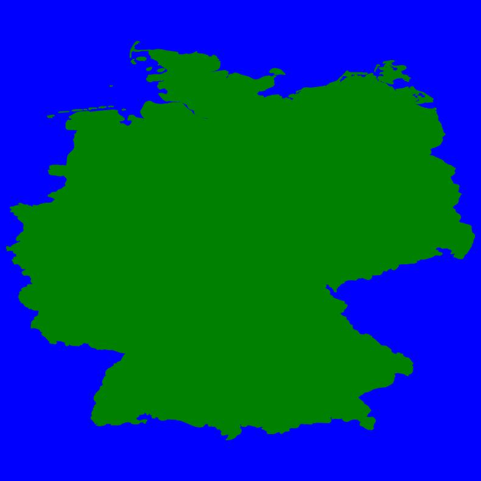
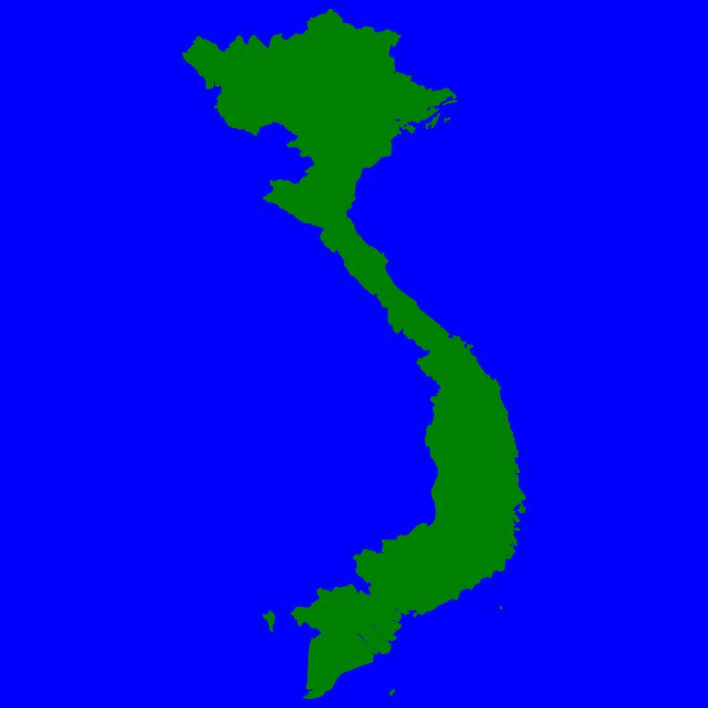

# Country Shape Extractor

This project extracts and processes country shapes from a shapefile and generates images for each country's boundary. The images are saved in the format `ISOStandardCode-CountryName.jpg`.
This is not intended to be used as a standalone project and is a partial code to help with some other project where I am using country boundaries.

## Features

- Downloads the latest shapefile from the World Bank if not present locally.
- Processes each country's shape and generates an image of its boundary.
- Supports polygons and multipolygons.
- Saves the images with a sanitized filename format.
- Allows the user to clean up the output directory after processing.

## How to Run

1. **Clone the Repository**:
```
git clone https://github.com/ARJUNRAGHUNANDANAN/Python-Guess-The-Country-Game.git
cd Python-Guess-The-Country-Game
cd Node-Country-Shape-Generator
```

2. **Install Required Libraries**:
Install the required Python libraries listed in the `requirements.txt` file:

```
pip install -r requirements.txt
```

3. **Run the Script**:
Execute the Python script using the following command:

```
python country_shape_extractor.py
```


4. **Choose Shapefile Source**:
The script will prompt you to either use the default shapefile location or specify a new one. If the default location is selected and the shapefile is not found, it will automatically download and extract the latest version.

5. **Output**:
The extracted country shapes will be saved as images in the `exported_data` directory within the project's base directory.

6. **Cleanup**:
After processing, the script will prompt you to delete the `exported_data` directory. You can choose to either delete or preserve it.

## Directory Structure

Some are given at start and some are generated during the program execution. 

```
project-directory/
│
├── WB_countries_Admin0_10m/
│ ├── WB_countries_Admin0_10m.shp
│ └── (other shapefile-related files)
│
├── exported_data/
│ ├── (generated image files)
│ └── (country json file)
│ └── (game data directories, if applicable)
│
├── country_shape_extractor.py
├── introduction.md
└── requirements.txt
```

## Result Output
 The JSON file containing all extracted countries and its images will be present in `exported_data` in the following format

```
[
    {
        "name": "Indonesia",
        "iso_code": "ID",
        "filename": "ID-Indonesia.jpg"
    },
    {
        "name": "Malaysia",
        "iso_code": "MY",
        "filename": "MY-Malaysia.jpg"
    }
]
```
## Sample Images

### Good Outputs Example

| Saudi Arabia  | Germany         |
|:--------------|:----------------|
|  |  |
|  |  |
|                |                 |
### Bad Outputs Example

| United States of America | Russia          |
|:-------------------------|:-----------------|
|  |  |
|                |                 |

### Notes

- **Good Outputs Example**: Images that demonstrate correct processing of country boundaries.
- **Bad Outputs Example**: Images that may show issues or errors in boundary extraction.


## Notes

- While the script accurately generates most of the shape files. its not High Definition and shapes are not that clear for countries that are massive or spread across a wide area or water body. For Example. USA is weird at the moment. Russia is too stretched. Some island groups are very small to see. 
- Ensure that you have an active internet connection if the shapefile needs to be downloaded.

## License for Code

This code is open-source and free to use under the MIT License. Modify and reuse as you wish.

## License for Dataset
> World Bank Official Boundaries 
>
> Classification: Public
> 
> This dataset is classified as Public under the Access to Information Classification Policy. Users inside and outside the Bank can access this dataset. 
>
>License: Creative Commons Attribution 4.0
> 
> URL : https://datacatalog.worldbank.org/search/dataset/0038272/World-Bank-Official-Boundaries
>
