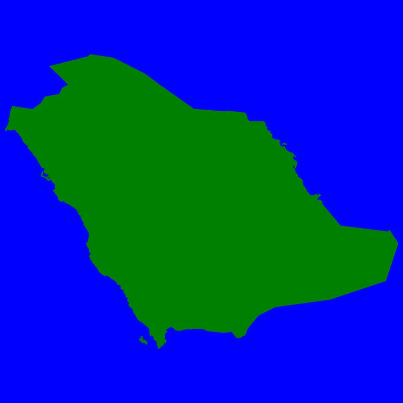

# Python-Guess-The-Country-Game

This project is actively under development. There are MD Files in each sub folder describing the details of each folder for the time being. 

## Main Home Repo Structure

The project is organized into several components, each with a specific purpose. Here's an overview of the main directories:

### Shape Generator
**Module-Country-Shape-Generator/**: This folder contains the code and resources for generating country shape images used in the game. The images are saved in the format `ISOStandardCode-CountryName.jpg`. Note that this directory contains a partial project focused on the generation of country shapes and not the entire game logic.

| Saudi Arabia  | Germany         | The Bahamas  | Vietnam         |
|:--------------|:----------------|:--------------|:----------------|
|  |  |  |  |

### Game UI
**Module-Country-Guesser-Simple-UI/**: This folder contains the code and resources for a simple country guesser game.This app uses a copy of the data generated by the previous module. This is a Flask App. 

| Re-Try  | Correct | Wrong |
|:----|:------|:-------|
|  |  | |
|                |                 |

Other parts are still pending. 

## License for Code

This code is open-source and free to use under the MIT License. Modify and reuse as you wish.
